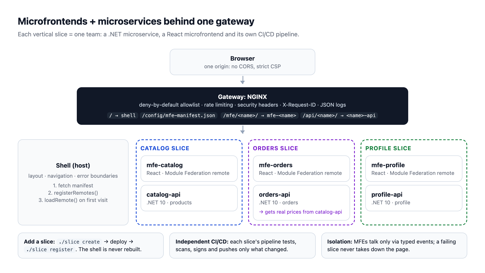
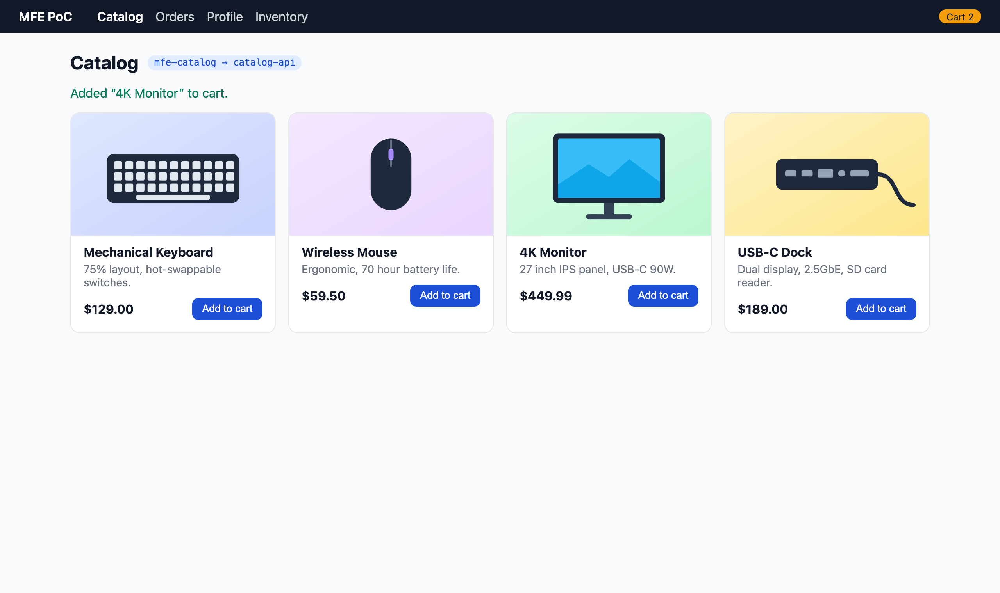
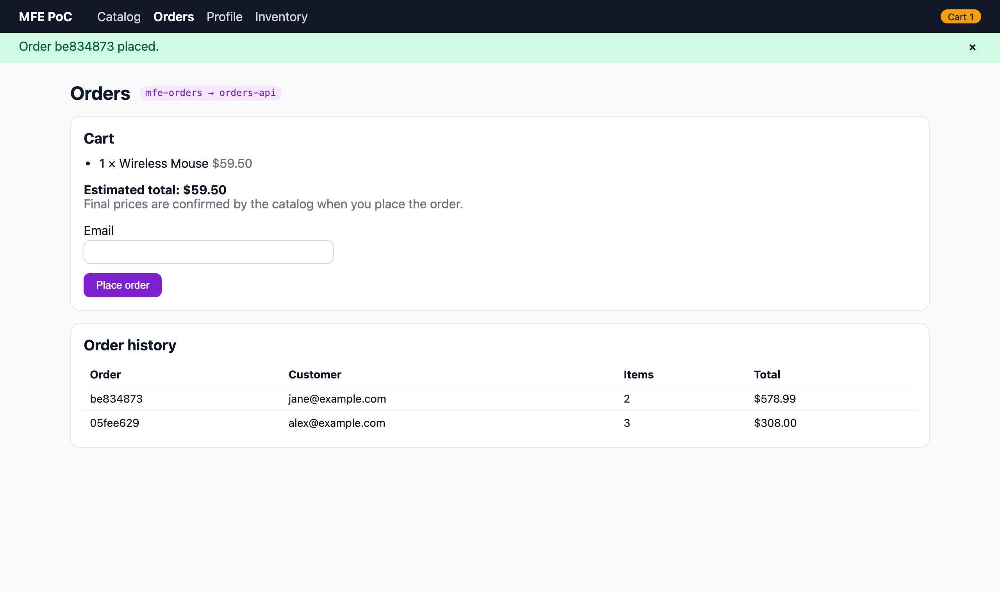
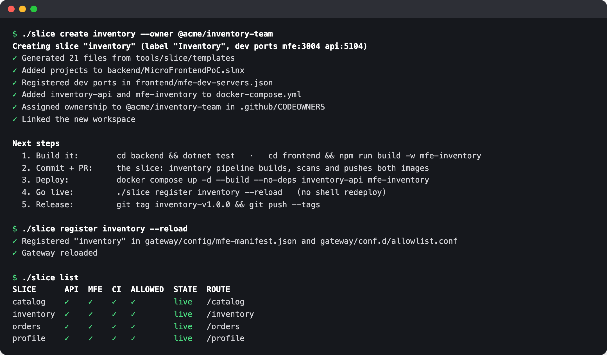
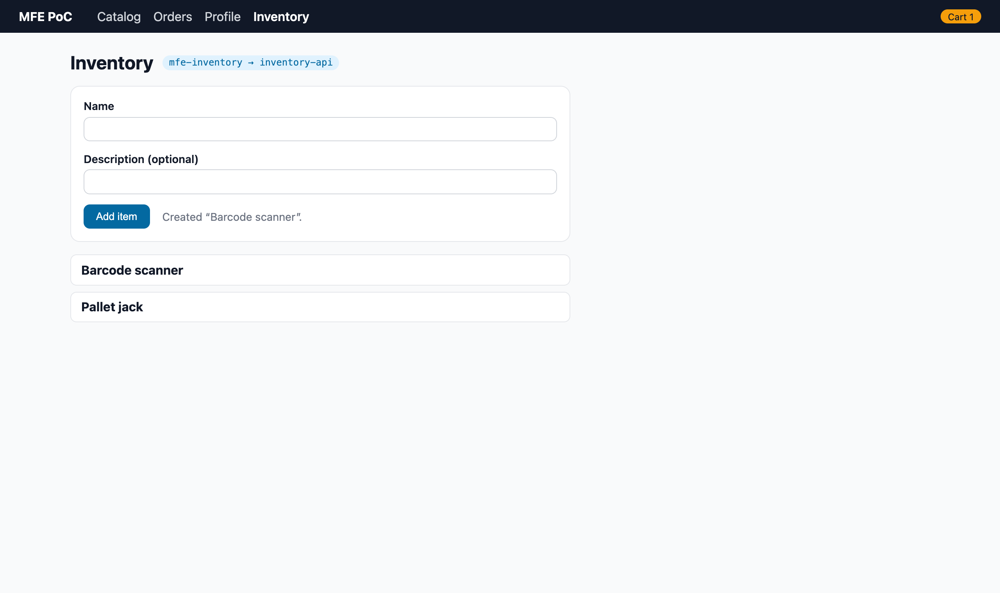
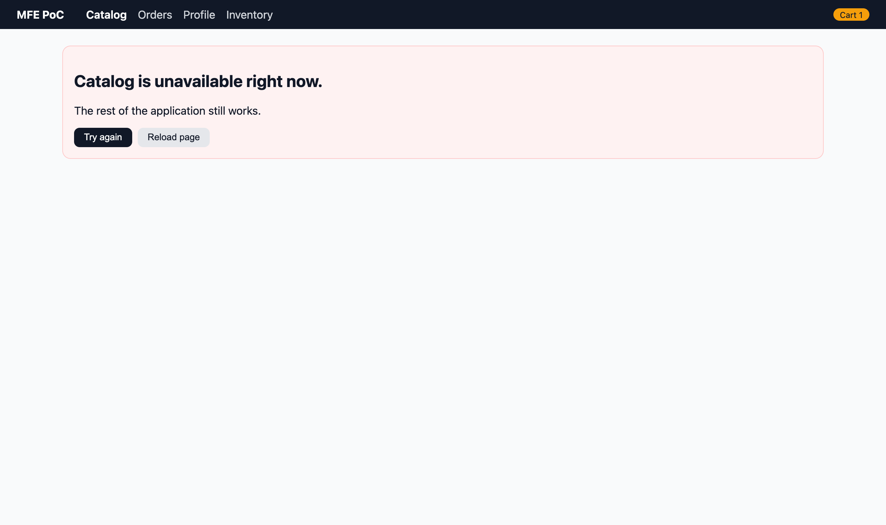

# MicroFrontend PoC



A small, production-shaped proof of concept for **microfrontends + microservices behind a single NGINX gateway**, packaged as a **framework**:

- **Manifest-driven dynamic remotes**: adding a microfrontend never requires rebuilding or redeploying the shell.
- **Vertical slices** (one API + one MFE + one pipeline per team), generated and managed by the `./slice` CLI.
- **Independent CI/CD per slice**: test, scan, sign and push only what changed; release each slice with its own tags.

- **Frontend:** React 19 + Vite 8 + Module Federation (`@module-federation/vite` + `@module-federation/runtime`), TypeScript
- **Backend:** .NET 10 Minimal APIs, one service per business capability
- **Gateway:** NGINX, the only public entry point

## Architecture

The diagram above shows the moving parts. In text form:

```
                          Browser  (http://localhost:8080)
                                 │
                 ┌───────────────▼────────────────┐
                 │        gateway (NGINX)         │  allowlist (deny by default), rate limiting,
                 │  /config/mfe-manifest.json     │  security headers + CSP, request-id, JSON logs
                 └──┬──────────────┬───────────┬──┘
       /  (host)    │  /mfe/<name>/│           │ /api/<name>/
                    ▼              ▼           ▼
                  shell        mfe-<name>   <name>-api
                    │         (catalog,     (.NET 10)
                    │          orders,
                    │          profile)
                    │
   1. GET /config/mfe-manifest.json  → which remotes exist, where, which route
   2. registerRemotes(...)           → Module Federation runtime
   3. loadRemote('<name>/App')       → only when the route is first visited
```

Each microfrontend is owned alongside its microservice (a **vertical slice**):

| Slice   | Microfrontend               | Microservice                   | Gateway routes                     |
|---------|-----------------------------|--------------------------------|------------------------------------|
| Shell   | `frontend/apps/shell`       | none                           | `/`                                |
| Catalog | `frontend/apps/mfe-catalog` | `backend/src/Services/Catalog` | `/mfe/catalog/*`, `/api/catalog/*` |
| Orders  | `frontend/apps/mfe-orders`  | `backend/src/Services/Orders`  | `/mfe/orders/*`, `/api/orders/*`   |
| Profile | `frontend/apps/mfe-profile` | `backend/src/Services/Profile` | `/mfe/profile/*`, `/api/profile/*` |

Because the browser only talks to the gateway, everything is **same-origin**, so there is no CORS and no hard-coded hosts in the frontend.

## Quick start (Docker)

```bash
docker compose up -d --build
open http://localhost:8080
```

Port 8080 busy? `GATEWAY_PORT=8088 docker compose up -d` (or copy `.env.example` to `.env`).

Try it: add products in **Catalog** → the cart badge in the shell updates → place the order in **Orders** → edit your **Profile**.

| Catalog (cart updates the shell) | Orders (prices confirmed by catalog-api) |
|---|---|
|  |  |

## Demo (5 minutes)

`./demo.sh` walks through the whole story, pausing between steps (`DEMO_AUTO=1` runs it straight through):

1. Start the platform.
2. Show the runtime manifest the shell reads.
3. Try to buy a $449.99 monitor for $0.01: the price is ignored and taken from catalog-api.
4. **Create a new slice with one command:** API + tests + MFE + CI pipeline.
5. Deploy **only** that slice.
6. Register it, then show the shell container was neither rebuilt nor restarted.
7. Kill switch: hide a slice without deploying.
8. Stop a slice's container; the rest of the app keeps working.
9. Clean up.

| `./slice create` + `./slice register` | The new slice, live without touching the shell |
|---|---|
|  |  |

| One slice down, the rest keeps working |
|---|
|  |

## Dynamic remotes (manifest-driven)

The shell has **no compile-time knowledge of any remote**. At startup it fetches
[`gateway/config/mfe-manifest.json`](gateway/config/mfe-manifest.json) (validated against
[`mfe-manifest.schema.json`](gateway/config/mfe-manifest.schema.json)), registers the remotes with the
Module Federation runtime, and builds its routes and navigation from it.

```json
{
  "schemaVersion": 1,
  "remotes": [
    { "name": "catalog", "entry": "/mfe/catalog/remoteEntry.js", "route": "/catalog", "nav": { "label": "Catalog", "order": 10 } }
  ]
}
```

| Field           | Required | Meaning |
|-----------------|----------|---------|
| `name`          | yes      | Module Federation name of the remote; also the gateway convention key (`mfe-<name>`, `<name>-api`). |
| `entry`         | yes      | Same-origin path under `/mfe/<name>/` ending in `remoteEntry.js`. |
| `route`         | yes      | Shell route; the remote owns everything below it. |
| `exposedModule` | no       | Defaults to `./App`. |
| `nav`           | no       | `{ label, order }`. Omit it for routable-but-hidden remotes. |
| `enabled`       | no       | Kill switch, defaults to `true`. |

| What changes | Redeploy shell? | Rebuild gateway image? | What to do |
|---|---|---|---|
| New version of an existing MFE | No | No | Deploy the MFE container. `remoteEntry.js` is `no-cache`. |
| **Add a new MFE** | **No** | **No** | Deploy it, add it to the manifest + allowlist, reload NGINX. |
| Disable a broken MFE (kill switch) | No | No | `"enabled": false` in the manifest. Takes effect on the next page load. |
| Change shell code | Yes | No | |

### Adding a new slice: one command, zero shell changes

```bash
./slice create inventory --owner @acme/inventory-team   # API + tests + MFE + pipeline + compose + dev ports
docker compose up -d --build --no-deps inventory-api mfe-inventory
./slice register inventory --reload                     # manifest + allowlist, validated, live
```

See the **[slice framework guide](tools/slice/README.md)** for every command, the pipeline
design and the image policy. `npm run validate:manifest` (also run in CI) checks the manifest
with the exact rules the shell uses at runtime, **and** that every enabled remote is allowlisted at the gateway.

### Production safeguards

| Concern | How it's handled |
|---|---|
| Manifest pointing at a malicious script | `entry` must be a same-origin path under `/mfe/<name>/` (no scheme, host, `..` or query). The CSP `script-src 'self'` enforces the same thing in the browser. |
| Exposing internal containers | The gateway routes by convention but is **deny-by-default**: only names in `allowlist.conf` are reachable. Anything else gets 404. |
| Manifest unavailable | Fetch with timeout, retry with exponential backoff (5xx/network only), then fall back to the **last-known-good** copy in `localStorage` (with a banner). The shell always renders. |
| One bad manifest entry | Only that entry is dropped and reported; the rest still loads. Duplicate names and overlapping routes are rejected. |
| Remote down or slow | 15 s load timeout plus a per-remote error boundary. The gateway returns 503 `problem+json`. **Try again** forces re-registration and busts caches, so recovery needs no page reload. |
| Remote breaks the contract | The exposed module is checked to be a React component before rendering. |
| Unknown future manifest format | `schemaVersion` is checked. An unsupported version is rejected as a whole, which falls back to LKG. |
| Accessibility | Skip link, focus moved to `<main>` on navigation, per-route `document.title`, `role=status/alert` live regions, labelled form errors. |
| Observability | `reportError()` in the shell (wire it to your RUM/APM), `X-Request-ID` on every service log line, one structured log line per request, W3C `traceId` in every error, OpenTelemetry in services. |
| Price tampering | Clients send only `productId` + `quantity`. orders-api prices every line from catalog-api, rejects unknown/duplicate products, and returns 503 if the catalog is down. |
| Oversized requests | Max 50 lines per order, 100 ids per catalog batch, paged order lists (max 100 per page), 1 MB body limit at the gateway. |
| Host-header injection | Services don't trust `X-Forwarded-Host`, forwarded headers are accepted only from private networks, and `Location` headers are relative. |

## CI/CD (independent per slice)

Every slice has its own GitHub Actions pipeline (`slice-<name>.yml`, generated) built from two
reusable workflows and one shared image action. A change to `mfe-orders` builds and ships
**only** `mfe-orders`; a tag like `orders-v1.4.0` releases only the orders slice.

| Pipeline | Triggers on | Publishes (GHCR) |
|---|---|---|
| `slice: <name>` | that slice's API/MFE paths, `<name>-v*` tags | `<name>-api`, `mfe-<name>` |
| `platform: shell` | `frontend/apps/shell/**`, `shell-v*` | `shell` |
| `platform: gateway` | `gateway/**`, `gateway-v*` | `gateway` (+ validates manifest/allowlist) |

Every image is scanned (Trivy; build fails on fixable CRITICAL/HIGH), gets an SBOM and signed
provenance, and is tagged `sha-<short>`, `main` or a semver release (never `latest`). Actions
are SHA-pinned and kept current by Dependabot. Details: [tools/slice/README.md](tools/slice/README.md#cicd).

To publish, push this repo to GitHub. The pipelines use the built-in `GITHUB_TOKEN`, so no secrets are needed.

## Local development (no Docker)

```bash
# APIs (one terminal each)
dotnet run --project backend/src/Services/Catalog/Catalog.Api   # http://localhost:5101
dotnet run --project backend/src/Services/Orders/Orders.Api     # http://localhost:5102
dotnet run --project backend/src/Services/Profile/Profile.Api   # http://localhost:5103

# all frontends (every app in frontend/apps is discovered automatically)
cd frontend && npm install && npm run dev
open http://localhost:3000
```

Each remote also runs **standalone** (e.g. http://localhost:3001/mfe/catalog/), so a team can work on its MFE without the shell.
In dev the shell serves the same manifest file, and proxies `/mfe/<name>` and `/api/<name>` using
[`frontend/mfe-dev-servers.json`](frontend/mfe-dev-servers.json), which mirrors what the gateway does in Docker.

OpenAPI documents (Development only): `/api/<name>/openapi/v1.json`.

## Project layout

```
├── demo.sh                      guided 5-minute demo (./demo.sh)
├── docs/images/                 architecture diagram + screenshots
├── slice                        platform CLI (./slice --help)
├── tools/slice/                 CLI + slice templates + framework guide
├── docker-compose.yml
├── .github/
│   ├── actions/container-image  shared build → scan → push → attest
│   ├── workflows/               _build-*.yml (reusable), slice-<name>.yml (generated), shell.yml, gateway.yml
│   ├── dependabot.yml
│   └── CODEOWNERS               per-slice ownership
├── gateway/
│   ├── conf.d/default.conf      routing (convention based), headers, rate limits
│   ├── conf.d/allowlist.conf    which <name>s are public (runtime config)
│   ├── snippets/                shared security headers
│   └── config/                  mfe-manifest.json (runtime MFE registry) + JSON schema
├── backend/
│   ├── MicroFrontendPoC.slnx
│   ├── Directory.Build.props    shared: net10.0, nullable, analyzers, warnings-as-errors
│   ├── src/BuildingBlocks/ServiceDefaults   health checks, OpenTelemetry, ProblemDetails, logging
│   ├── src/Services/Catalog/Catalog.Api     products (read-only)
│   ├── src/Services/Orders/Orders.Api       orders (create/list, validated)
│   ├── src/Services/Profile/Profile.Api     profile (get/update, validated)
│   └── tests/                   integration tests (WebApplicationFactory + xUnit v3)
└── frontend/                    npm workspaces
    ├── Dockerfile               one parameterised image for every app (APP build-arg)
    ├── nginx/                   static-hosting configs (shell = SPA, remote = assets)
    ├── mfe-dev-servers.json     local dev routing (mirrors the gateway)
    ├── scripts/                 dev runner, manifest validator (CI)
    ├── packages/contracts       RemoteAppProps contract, typed events, cart storage
    └── apps/{shell,mfe-catalog,mfe-orders,mfe-profile}
        └── shell/src/manifest   runtime manifest loading + validation (unit tested)
```

## Key design decisions

**Microfrontends**
- **Runtime composition.** Remotes are discovered from the manifest and loaded with `@module-federation/runtime` (`registerRemotes` / `loadRemote`). The shell's build contains no remote list. `remoteEntry.js` and the manifest are `no-cache`; hashed assets are `immutable`.
- **Shared singletons:** `react` and `react-dom` are shared so only one copy is loaded. `@module-federation/runtime` is pinned to the plugin's version so there is exactly one federation instance.
- **Loose coupling.** MFEs never import each other. They communicate only through the `@mfe/contracts` package: typed `CustomEvent`s on `window`, plus `sessionStorage` for the cart. Treat that package as a public API: additive changes only.
- **Fault isolation:** each remote is mounted by `RemoteOutlet` (Suspense, error boundary, timeout and real retry). If one MFE is down, the rest of the app still works.
- **Style isolation:** remotes use CSS Modules; only the shell defines global styles.

**Microservices**
- Each service is independently buildable and deployable, has its own Dockerfile, and owns its data (in-memory here; swap the repository/store for a real database per service).
- Services are **not exposed** to the host; only the gateway is. They run as non-root, on a read-only filesystem.
- Routes keep their gateway prefix (`/api/<name>/...`) so NGINX proxies without URL rewriting.
- `ServiceDefaults` gives every service: `/health/live` and `/health/ready` (used by the Docker `HEALTHCHECK`), RFC 9457 ProblemDetails with the W3C `traceId`, JSON logs in production with the gateway's `X-Request-ID`, request logging, forwarded-headers support (private networks only), and OpenTelemetry (exported when `OTEL_EXPORTER_OTLP_ENDPOINT` is set).
- **Service-to-service calls** go directly over the private network, not through the gateway: orders-api uses a typed `HttpClient` (5 s timeout) to fetch prices from catalog-api in one batch call.
- Runtime images are `aspnet:10.0-alpine`: small, non-root, read-only filesystem.

**Gateway**
- Convention routing (`/mfe/<name>` → `mfe-<name>`, `/api/<name>` → `<name>-api`) guarded by an allowlist.
- Upstreams resolved per request via Docker DNS, so the gateway starts even if a service is down; a missing slice returns 503 `problem+json`.
- Per-IP rate limit on `/api` (429 on excess), 1 MB body limit, timeouts.
- Security headers including a strict CSP (`script-src 'self'`), `X-Request-ID` propagation, JSON access logs.

## Commands

```bash
./slice list                               # slices and their state
cd backend  && dotnet test                 # backend integration tests
cd frontend && npm test                    # shell unit tests (manifest validation/loading)
cd frontend && npm run validate:manifest   # manifest + allowlist consistency
cd frontend && npm run typecheck           # TS checks for all workspaces
cd frontend && npm run build               # production builds
docker compose exec gateway sh -c 'nginx -t && nginx -s reload'   # apply allowlist changes
docker compose logs -f gateway             # JSON access logs
```

## Scope and known limitations

This repository is **scaffolding**: the structure, contracts, pipelines and guard rails are meant to be
production-shaped, but some things are intentionally left out to keep it focused. Don't deploy it as-is.

| Not included | Why it matters | Where it would go |
|---|---|---|
| **Authentication / authorization** | Anyone can call every API. `GET /api/orders` lists every customer's email, and Profile is one shared demo user. | An identity provider (OIDC) + a BFF in front of the APIs; token validation and permission checks in `ServiceDefaults`. |
| **Persistence** | All data is in memory and resets on restart. | A database per service behind the existing repository interfaces. |
| **TLS** | Everything is plain HTTP locally. | Terminate TLS at the gateway or a load balancer, then enable HSTS. |
| **Idempotency** | A retried `POST /api/orders` creates a second order (the UI disables the button, but the API doesn't dedupe). | An `Idempotency-Key` header stored with the order. |
| **Resilience policies** | The orders → catalog call has a timeout but no retries or circuit breaker. | `Microsoft.Extensions.Http.Resilience` (`AddStandardResilienceHandler`). |
| **Rate limiting per user** | NGINX limits per IP; behind a load balancer every client shares one IP. | Use the real client IP (`real_ip_header`), or limit per user once auth exists. |

## Next steps toward real production

- TLS termination (enable the commented HSTS header in `gateway/snippets/security-headers.conf`).
- A real database per service + migrations; async integration events (e.g. order placed → RabbitMQ/Kafka) instead of synchronous coupling.
- CD: promote the images CI pushes (`sha-*` / semver) per environment, e.g. with GitOps (Argo CD/Flux). On Kubernetes: Deployments + Services named by the same convention, the gateway (or an Ingress) in front, and the manifest + allowlist as ConfigMaps managed by `./slice register` in the env repo.
- Manifest management: generate it from a registry or deploy pipeline (each slice's pipeline registers itself), and consider per-environment/per-tenant manifests for canary releases.
- Subresource integrity for `remoteEntry.js` (needs content-hashed entry names published to the manifest at deploy time).
